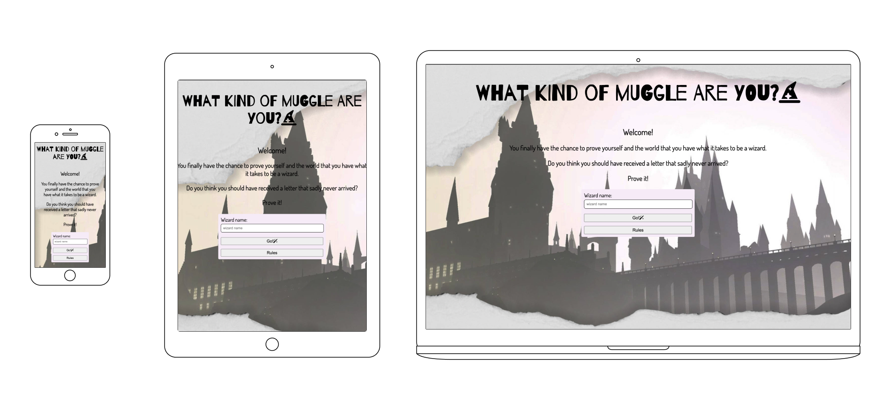
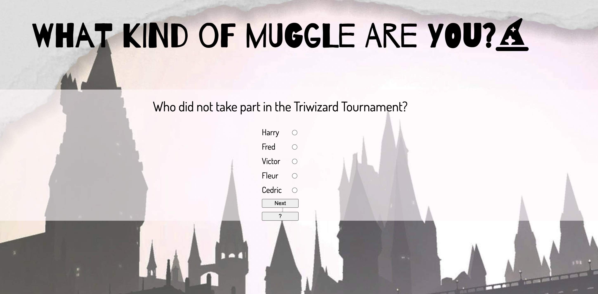
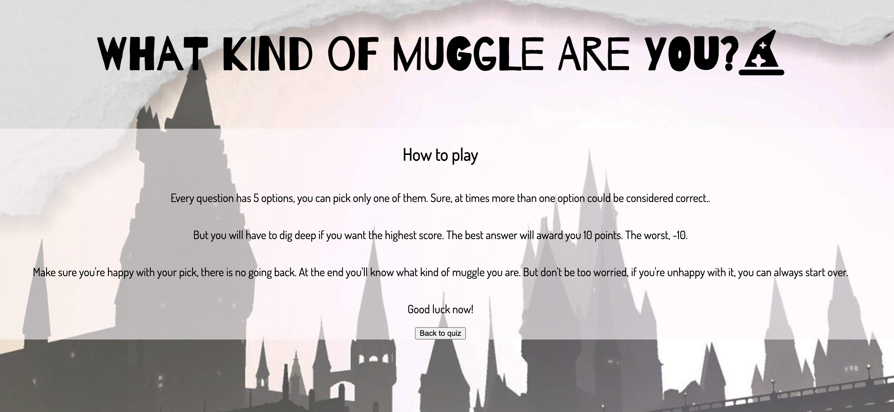
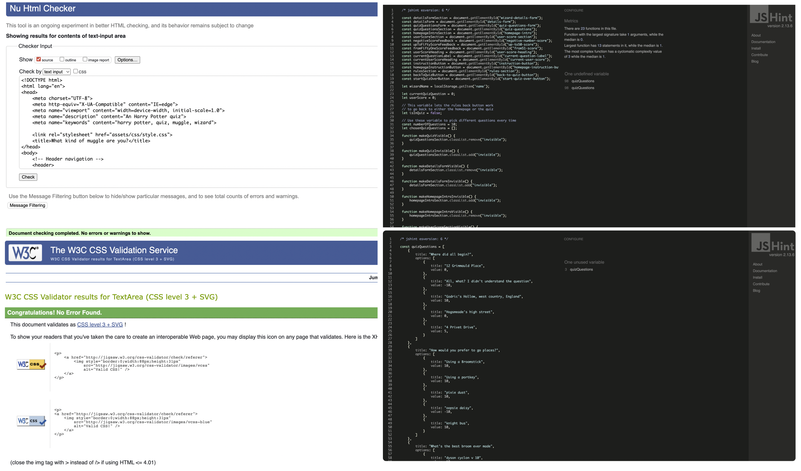

# What kind of muggle are you?

This is a quiz game addressed to Harry Potter's fans. The main goal is to entertain users online. Questions can be tricky and multiple options can be at the same time somehow correct. Users need to provide their best answers in order to get the highest score possible. After answering 10 questions, they will be given an answer to the main question: "What kind muggles are they?". If they are unhappy with the outcome, they can try again.

The live link to the quiz can be found here: (add link)!!!!!!!!!!!!!!!!!!!!

----
## Features

__Homepage__: 

This is a welcome to the quiz page. It presents a header and a brief message to the user. The content is centered and there is contrast with the background. A form is also present with the request to provide a name (wizard name)in order to proceed to the actual quiz. The name is mandatory as it is needed in order to be stored  along with the score and be shown at the end of the quiz. If the users does not provide a name, they won't be able to play. This page is resposive to multiple devices. The details form has been styled with the addition of a background color so that it's always perfectly visibile on the background on different screen sizes. Once the user has typed a name they can use the go button that will take them directly to the first quiz question.

__Quiz__: 

The Quiz section will become visible only after the user has provided a name and has clicked on the go button. The questions all have 5 options and each option has been assigned a specific value. A negative value of -10 if the answer is completely wrong and a positive value if it is correct. The best option is worth 10 points. The values then get added and give the final score. For the quiz section a background color with an opacity has been added so that the text is always perfectly visible but the background does not conflict with the main background. During the quiz the user can always check the instructions. There are two buttons at the bottom of each question. One to go to the next question and one to go to the rules. 

__Instruction button__ : 

The instruction button "?" takes the user to the rules of the game. The style is consistent with the quiz and the background with the opacity is also here present. This screen along with everything else, is also responsive.  In order to return to the quiz a "back to quiz" button at the rules text can be clicked. Once clicked the user will be taken back to the same question where they were before clicking the "?" button.

__Score__ : 

The score page presents the final score to the user along with the name they provided at the beginning. Depending on the score they got, the user will get different outcomes. In particular there are 3 different score blocks. One if they got a negative number, one if they scored a number between 0 and 50 and the last one for users that scored a number from 51 to 100. A "try again" button is also present. If clicked, the user will start the quiz again. The user that wants to start the quiz over will not be asked for their name again. The quiz will start automatically as soon as they click the button. 

----
## Testing

__Manual testing__: I have tested the quiz manually to ensure it works as intended on different devices. 
1. The media query are working as intended adapting all the sections to the preferred screen device. When resizing, the elements work correctly. 
2. I have checked that all the elements present on the page are visible or invisible at the right time. 
3. I have checked that the user can't proceed if they don't provide a name.
4. I have checked that the user can go back respectively to the homeage or to the right question when they click on the instruction button. 
5. I have checked that the user can't proceed to the next question if they do not provide an answer.
5. I have checked that they are not asked for their name again if they decide to start the quiz again after an attempt.  

__Validators__: 
The code has been tested using respectively w3cvalidator for [html](https://validator.w3.org/#validate_by_input), jigsaw for [css](https://jigsaw.w3.org/css-validator/) and jshint for [javascript](https://jshint.com/). In javascript the validator gave me multiple warnings for the use of "const". I have then put the version specification in the file in order to get rid of them. The variable "quizQuestions" has been highlighted in both js file. The reason is that I have defined it in one file and used it in the other one. Question.js in fact only contains a list of all the quiz questions. I have 2 js files as make only one file including all the questions, options, and values would have made the file really hard to read and not organic. 

Additionaly,I have also used lighthouse for testing. Both desktop and mobile testing have retured an accessibility of 100%. 

__Fixed Bugs__: While developing the website I have changed the structure of the quiz making it more user friendly and encountered some styling obstacles. I have also encountered some obstacles in the logical part of it as for example how to pick a random number and make sure it is not repeated in the same quiz. 
1.  The first attempt of not showing sections on the page has been unsuccessful as I was using visibility:hidden. Visibility:hidden was hiding the section but taking the space of it. Using "display:none" instead has solved the issue so that the sections kept hidden would not occupy space on the page when not showing.
2.  In the quiz section there are 2 buttons. Originally I didn't specify the type of the button so that the "next" button was working as intented showing the next question but the "?"instruction button was showing the instruction and taking the user back to the next question when going back to the quiz even if they had not picked their answer yet. To solve this I have added types to the buttons. The next button needed the "submit" type, the instruction button, just a "button" type.
3. Understanding how to pick one of the questions randomly and not having it repeated in the quiz has been another challenge. To solve this I have been searching online. Eventually I have used and adapted the solution presented here https://stackoverflow.com/a/2380113  that picks a question and shows it only if not already picked before. 

----
## Deployment

----
## Credits

1. The background image has been taken from google images. 
2. The code to pick a random question and have it dispayed if not chosen before has been taken from here:  https://stackoverflow.com/a/2380113 
3. The structure of this readme file has been taken from the CI Love running project. 
----